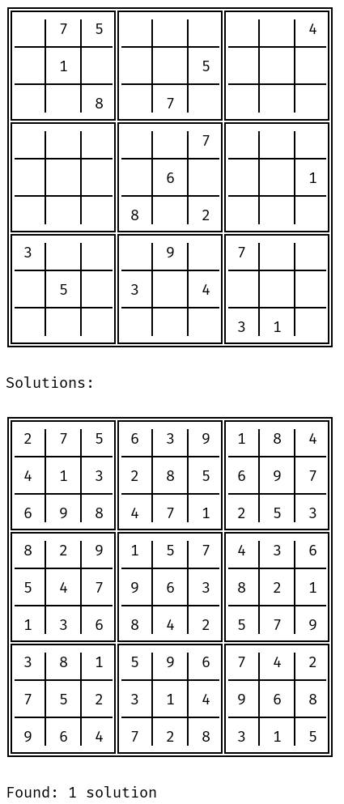
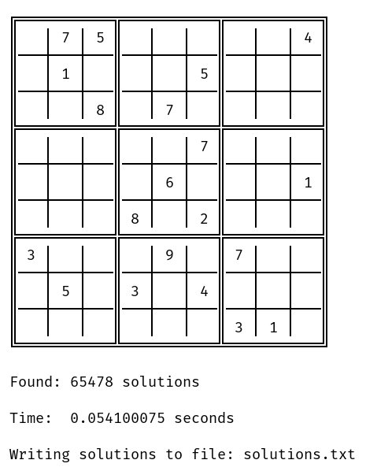
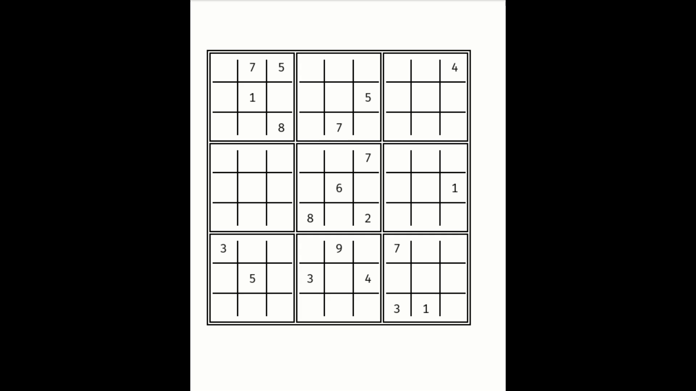
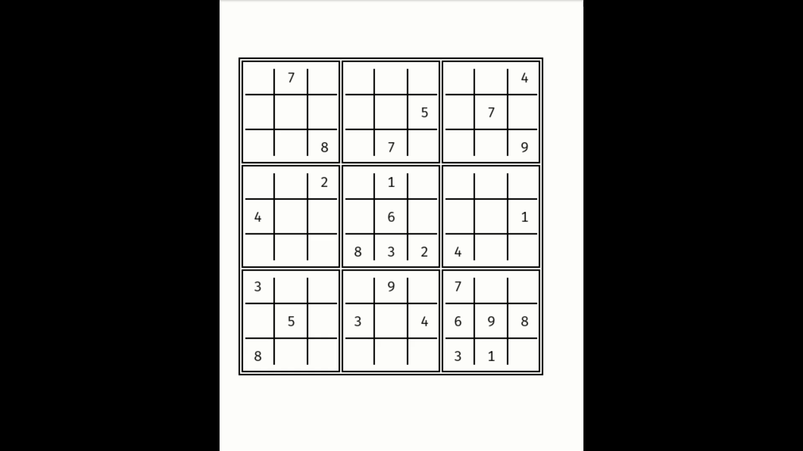
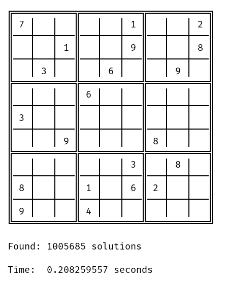

# sudoku-cli

---
## About

* A command-line tool for solving sudoku puzzles. 
* If your input is a file path, `sudoku-cli` will read from the file. Otherwise it treats the string as input.  
* `sudoku-cli` reads the first 81 non-whitespace characters from the input and fills each row from left to right, 
starting with the top row.
* `sudoku-cli` can output results to a file. The directory must already exist.

---
## Commands

`sudoku-cli` has 5 sub-commands each with their own configurable options:
* `sudoku-cli find-one`: Finds a solution to the sudoku puzzle.
    * `-i=<value> | --input=<value>` the puzzle input. [required]
    * `-t=<value> | --threads=<value>` the number of threads to use. [default: CPU count]
    * `-o=<value> | --output=<value>` the file in which to write solutions. [default: terminal]
    * `-c | --compact` write output in a compact form. 
* `sudoku-cli find-all`: Finds all solutions to an ambiguous sudoku puzzle.
    * `-i=<value> | --input=<value>` the puzzle input. [required]
    * `-t=<value> | --threads=<value>` the number of threads to use. [default: CPU count]
    * `-o=<value> | --output=<value>` the file in which to write solutions. [default: terminal]
    * `-c | --compact` write output in a compact form. 
* `sudoku-cli watch-one`: Watch the solver find a solution in the terminal.
    * `-i=<value> | --input=<value>` the puzzle input. [required]
    * `-m=<value> | --ms-per-frame=<value>`: the milliseconds per frame [default: 50]
* `sudoku-cli watch-all`: Watch the solver find all solutions in the terminal.
    * `-i=<value> | --input=<value>` the puzzle input. [required]
    * `-m=<value> | --ms-per-frame=<value>`: the milliseconds per frame [default: 50]
* `sudoku-cli count-all`: Finds all solutions to an ambiguous sudoku puzzle.
    * `-i=<value> | --input=<value>` the puzzle input. [required]
    * `-t=<value> | --threads=<value>` the number of threads to use. [default: CPU count]
    
---
 ## Examples
 
---
 ### Find One
 
`sudoku-cli find-one --input=".75.....4.1...5.....8.7.........7.......6...1...8.2...3...9.7...5.3.4.........31."`

---

 ### Find All
 
`sudoku-cli find-all --input=path/to/puzzle --threads=8 --output=solutions.txt --compact`

---

 ### Watch One
 
`sudoku-cli watch-one --input=path/to/puzzle`

---

 ### Watch All

`sudoku-cli watch-all --input=path/to/puzzle --ms-per-frame=15`

---

 ### Count All

`sudoku-cli count-all --input=path/to/puzzle --threads=8`

